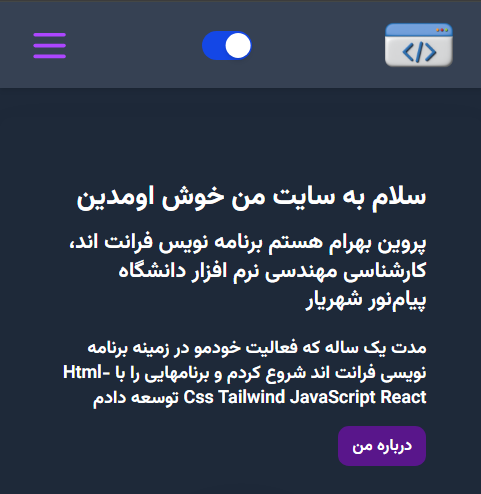
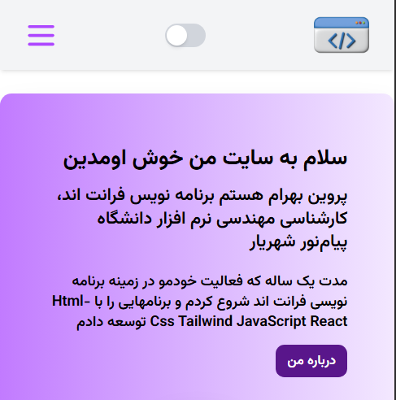

# MyResume-OOP 

 
 

 ### *an RTL Portfolio and Resume website in object-oriented way*
## list of contents
- [Introduction](#Introduction)
- [Installation](#Installation)
- [Features](#Features)
- [Technologies Used](#Technologies-Used)
- [Preview](#Preview)
- [Roadmap](#Roadmap)
- [License](#License)
- [Contact](#Contact)


## Introduction
### This is a site designed to introduce someone and showcase their skills. built with an object-oriented approach, using JavaScript classes.


## Installation
 1- Clone the repository  
  ```bash
  git clone https://github.com/ParvinBahram/myresume-oop.git
  ```

 2- Please note that Node.js must already be installed on the system.


 3- Navigate to the project directory :
```bash 
cd repository-name
```

 4- In terminal, install dependency to create node modules folder:
  ```bash
    npm i
```

 5- Run the project
```bash
npm run dev 
```

## Features
 1- The website is fully responsive and mobile-first.

 2- supports both light and dark modes  .


## Technologies Used
 Created  with **HTML** , **CSS** ,**JavaScript** , **Tailwind Css** .

## Preview






## License
No license restrictions — free to use for everyone.

## Contact

📧 Email: example@email.com
